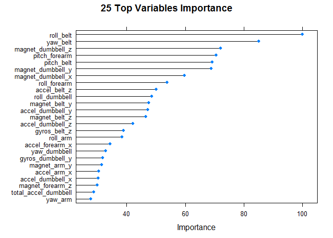
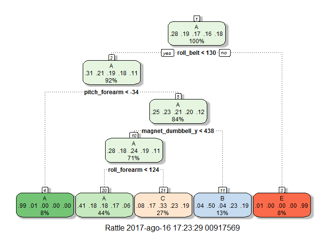

# Practical Machine Learning Sensor Data
Marco Marchetti  
16 August 2017  


## Background
Using devices such as Jawbone Up, Nike FuelBand, and Fitbit it is now possible to collect a large amount of data about personal activity relatively inexpensively. These type of devices are part of the quantified self movement – a group of enthusiasts who take measurements about themselves regularly to improve their health, to find patterns in their behavior, or because they are tech geeks. One thing that people regularly do is quantify how much of a particular activity they do, but they rarely quantify how well they do it. In this project, the goal will be to use data from accelerometers on the belt, forearm, arm, and dumbell of 6 participants. They were asked to perform barbell lifts correctly and incorrectly in 5 different ways:  
* Class A - exactly according to the specification  
* Class B - throwing the elbows to the front  
* Class C - lifting the dumbbell only halfway  
* Class D - lowering the dumbbell only halfway  
* Class E - throwing the hips to the front  

More information is available from the website here: <http://web.archive.org/web/20161224072740/http:/groupware.les.inf.puc-rio.br/har> (see the section on the Weight Lifting Exercise Dataset).

## Project Goal
The goal of the  project is to predict the manner in which participant did the exercise ("classe" variable in the training set). We will use prediction model to predict 20 different test cases.

## Data Cleaning and Preparation
We first load the R packages needed for analysis and then download the training and testing data sets.

```r
library(caret)
library(parallel)
library(doParallel)
library(rattle)
library(e1071)

# Getting Data
trainUrl <-"https://d396qusza40orc.cloudfront.net/predmachlearn/pml-training.csv"
testUrl <- "https://d396qusza40orc.cloudfront.net/predmachlearn/pml-testing.csv"
trainFile <- "pml-training.csv"
testFile  <- "pml-testing.csv"
if (!file.exists(trainFile)) {
  download.file(trainUrl, destfile=trainFile)
}
if (!file.exists(testFile)) {
  download.file(testUrl, destfile=testFile)
}
trainRaw <- read.csv("pml-training.csv",na.strings=c("NA","#DIV/0!",""))
testRaw <- read.csv("pml-testing.csv",na.strings=c("NA","#DIV/0!",""))
```

###Exploring

```r
class(trainRaw$classe)
```

```
## [1] "factor"
```

```r
levels(trainRaw$classe)
```

```
## [1] "A" "B" "C" "D" "E"
```

```r
dim(trainRaw) # 19622 observations and 160 variables
```

```
## [1] 19622   160
```

```r
length(which(as.numeric(colSums(is.na(trainRaw)))==0)) # how many NA
```

```
## [1] 60
```
The Training set has **19622** observations and **160** variables (**60** are mainly NA) and the testing data set contains **20** observations.  

###Cleaning
The data have a lot of NA values so we will remove all NA columns.  
We will also remove the first seven predictors since these variables includes log information (user_name, timestamp....) and are not related to the activity measurements.

```r
# remove NA columns
trainClean <- trainRaw[,which(as.numeric(colSums(is.na(trainRaw)))==0)]				
testClean <- testRaw[,which(as.numeric(colSums(is.na(testRaw)))==0)]	
# remove unnecessary vars
trainClean <- trainClean[,-(1:7)]				
testClean <- testClean[,-(1:7)]
```
After the cleaning phase the train (trainClean) and the test (testClean) data sets remains with **53** variables.

###Data Partitioning
Since we will be predicting classes in the testing dataset, we will split the training data into a training set (60%) and a validation set (40%).
We will use the training set to train the model and the validation set to assess the model performance.

```r
set.seed(1965)
inTrain = createDataPartition(trainClean$classe, p=0.6, list = FALSE)
trainSet = trainClean[inTrain, ]
validationSet = trainClean[-inTrain, ]
```

## Model Building
For this classification problem we will build a predictive model for activity recognition using the Decision Tree approach because it is easy to interpret and works well in a non-linear settings.
We will execute and compare 3 different "trees based" models looking which provides the best out of sample accuracy:  
1.  Classification and Regression trees (rpart)  
2.	Random forest decision trees (rf)  
3.	Stochastic gradient boosting trees (gbm)  

We will execute Cross Validation for the models using K = 5. 
Since we will use all predictor variables and k-fold cross validation the train would be computationally intensive and so we will execute Random Forest and Gradient Boosting with parallel computation.

```r
#cross validation
fitControl <- trainControl(method='cv', number = 5)
```

### 1. Classification and Regression trees
We will start to build a predictive model for activity recognition using Classification and Regression trees approach. We will use 5-fold cross validation but in this case we will not use parallel computation.

```r
modelRpart <- train(classe ~ ., data = trainSet, method = "rpart", trControl = fitControl)
save(modelRpart, file='./modelRpart.RData')
```


```r
#Model
modelRpart
```

```
## CART 
## 
## 11776 samples
##    52 predictor
##     5 classes: 'A', 'B', 'C', 'D', 'E' 
## 
## No pre-processing
## Resampling: Cross-Validated (5 fold) 
## Summary of sample sizes: 9421, 9421, 9421, 9421, 9420 
## Resampling results across tuning parameters:
## 
##   cp          Accuracy   Kappa     
##   0.03666350  0.5109532  0.36105039
##   0.06035437  0.4154253  0.20768528
##   0.11414333  0.3158145  0.04797609
## 
## Accuracy was used to select the optimal model using  the largest value.
## The final value used for the model was cp = 0.0366635.
```

```r
#Prediction and confusion matrix
predRpart <- predict(modelRpart, validationSet)
confMatrixRpart <- confusionMatrix(predRpart, validationSet$classe)
confMatrixRpart
```

```
## Confusion Matrix and Statistics
## 
##           Reference
## Prediction    A    B    C    D    E
##          A 2040  637  637  591  220
##          B   28  504   49  216  184
##          C  159  377  682  479  378
##          D    0    0    0    0    0
##          E    5    0    0    0  660
## 
## Overall Statistics
##                                           
##                Accuracy : 0.4953          
##                  95% CI : (0.4842, 0.5064)
##     No Information Rate : 0.2845          
##     P-Value [Acc > NIR] : < 2.2e-16       
##                                           
##                   Kappa : 0.3399          
##  Mcnemar's Test P-Value : NA              
## 
## Statistics by Class:
## 
##                      Class: A Class: B Class: C Class: D Class: E
## Sensitivity            0.9140  0.33202  0.49854   0.0000  0.45770
## Specificity            0.6286  0.92462  0.78496   1.0000  0.99922
## Pos Pred Value         0.4945  0.51376  0.32867      NaN  0.99248
## Neg Pred Value         0.9484  0.85229  0.88113   0.8361  0.89110
## Prevalence             0.2845  0.19347  0.17436   0.1639  0.18379
## Detection Rate         0.2600  0.06424  0.08692   0.0000  0.08412
## Detection Prevalence   0.5257  0.12503  0.26447   0.0000  0.08476
## Balanced Accuracy      0.7713  0.62832  0.64175   0.5000  0.72846
```

```r
overallRpartOse <- 1 - as.numeric(confMatrixRpart$overall[1]) 
overallRpartOse
```

```
## [1] 0.5047158
```
The Classification and Regression trees accuracy is **0.4953** and the out of sample error is **0.5047**

### 2. Random Forest
We will execute the Random Forest model on the training data using 250 tree and 5-fold cross validation.

```r
#cluster
cluster <- makeCluster(detectCores() - 1)
registerDoParallel(cluster)
#Random Forest train
modelRf <- train(  classe ~ ., data=trainSet,  trControl=fitControl, method='rf',ntree=250,  allowParallel = TRUE)
save(modelRf, file='./modelRf.RData')
stopCluster(cluster)
```


```r
#Model
modelRf
```

```
## Random Forest 
## 
## 11776 samples
##    52 predictor
##     5 classes: 'A', 'B', 'C', 'D', 'E' 
## 
## No pre-processing
## Resampling: Cross-Validated (5 fold) 
## Summary of sample sizes: 9420, 9421, 9422, 9420, 9421 
## Resampling results across tuning parameters:
## 
##   mtry  Accuracy   Kappa    
##    2    0.9891304  0.9862487
##   27    0.9876869  0.9844220
##   52    0.9802997  0.9750781
## 
## Accuracy was used to select the optimal model using  the largest value.
## The final value used for the model was mtry = 2.
```

```r
#Prediction and confusion matrix
predRf <- predict(modelRf, validationSet)						
confMatrixRf <- confusionMatrix(predRf, validationSet$classe)
confMatrixRf
```

```
## Confusion Matrix and Statistics
## 
##           Reference
## Prediction    A    B    C    D    E
##          A 2232    3    0    0    0
##          B    0 1509   12    0    0
##          C    0    6 1354   24    1
##          D    0    0    2 1262    3
##          E    0    0    0    0 1438
## 
## Overall Statistics
##                                           
##                Accuracy : 0.9935          
##                  95% CI : (0.9915, 0.9952)
##     No Information Rate : 0.2845          
##     P-Value [Acc > NIR] : < 2.2e-16       
##                                           
##                   Kappa : 0.9918          
##  Mcnemar's Test P-Value : NA              
## 
## Statistics by Class:
## 
##                      Class: A Class: B Class: C Class: D Class: E
## Sensitivity            1.0000   0.9941   0.9898   0.9813   0.9972
## Specificity            0.9995   0.9981   0.9952   0.9992   1.0000
## Pos Pred Value         0.9987   0.9921   0.9776   0.9961   1.0000
## Neg Pred Value         1.0000   0.9986   0.9978   0.9964   0.9994
## Prevalence             0.2845   0.1935   0.1744   0.1639   0.1838
## Detection Rate         0.2845   0.1923   0.1726   0.1608   0.1833
## Detection Prevalence   0.2849   0.1939   0.1765   0.1615   0.1833
## Balanced Accuracy      0.9997   0.9961   0.9925   0.9903   0.9986
```

```r
overallRfOse <- 1 - as.numeric(confMatrixRf$overall[1]) 
overallRfOse
```

```
## [1] 0.006500127
```
The Random Forest accuracy is **0.9924** and the out of sample error is **0.0076**

### 3. Stochastic Gradient Boosting
We will execute the Stochastic Gradient Boosting model on the training data using 5-fold cross validation without any others tuning parameters.

```r
##cluster
cluster <- makeCluster(detectCores() - 1)
registerDoParallel(cluster)
#Stochastic Gradient Boosting 
modelGbm <- train( classe ~ ., data=trainSet, method='gbm', trControl = fitControl)
save(modelRf, file='./modelGbm.RData')
stopCluster(cluster)
```


```r
#Model
modelGbm
```

```
## Stochastic Gradient Boosting 
## 
## 11776 samples
##    52 predictor
##     5 classes: 'A', 'B', 'C', 'D', 'E' 
## 
## No pre-processing
## Resampling: Cross-Validated (5 fold) 
## Summary of sample sizes: 9420, 9420, 9421, 9421, 9422 
## Resampling results across tuning parameters:
## 
##   interaction.depth  n.trees  Accuracy   Kappa    
##   1                   50      0.7554348  0.6898818
##   1                  100      0.8204823  0.7727645
##   1                  150      0.8548742  0.8162865
##   2                   50      0.8556386  0.8170152
##   2                  100      0.9050625  0.8798522
##   2                  150      0.9288398  0.9099713
##   3                   50      0.8975054  0.8702543
##   3                  100      0.9397099  0.9237058
##   3                  150      0.9597496  0.9490750
## 
## Tuning parameter 'shrinkage' was held constant at a value of 0.1
## 
## Tuning parameter 'n.minobsinnode' was held constant at a value of 10
## Accuracy was used to select the optimal model using  the largest value.
## The final values used for the model were n.trees = 150,
##  interaction.depth = 3, shrinkage = 0.1 and n.minobsinnode = 10.
```

```r
#Prediction and confusion matrix
predGbm <- predict(modelGbm, validationSet)
confMatrixGbm <- confusionMatrix(predGbm, validationSet$classe)
confMatrixGbm
```

```
## Confusion Matrix and Statistics
## 
##           Reference
## Prediction    A    B    C    D    E
##          A 2197   48    0    1    1
##          B   29 1420   53    4   12
##          C    6   50 1297   52   15
##          D    0    0   16 1216   18
##          E    0    0    2   13 1396
## 
## Overall Statistics
##                                           
##                Accuracy : 0.9592          
##                  95% CI : (0.9546, 0.9635)
##     No Information Rate : 0.2845          
##     P-Value [Acc > NIR] : < 2.2e-16       
##                                           
##                   Kappa : 0.9484          
##  Mcnemar's Test P-Value : 6.715e-09       
## 
## Statistics by Class:
## 
##                      Class: A Class: B Class: C Class: D Class: E
## Sensitivity            0.9843   0.9354   0.9481   0.9456   0.9681
## Specificity            0.9911   0.9845   0.9810   0.9948   0.9977
## Pos Pred Value         0.9777   0.9354   0.9134   0.9728   0.9894
## Neg Pred Value         0.9937   0.9845   0.9890   0.9894   0.9929
## Prevalence             0.2845   0.1935   0.1744   0.1639   0.1838
## Detection Rate         0.2800   0.1810   0.1653   0.1550   0.1779
## Detection Prevalence   0.2864   0.1935   0.1810   0.1593   0.1798
## Balanced Accuracy      0.9877   0.9600   0.9646   0.9702   0.9829
```

```r
overallGbmOse <- 1 - as.numeric(confMatrixGbm$overall[1])
overallGbmOse
```

```
## [1] 0.04078511
```
The Stochastic Gradient Boosting  accuracy is **0.9593** and the out of sample error is **0.0407**

## Model Assesment
We will compare models in terms of their resampling results. The random number seeds
were initialized to the same value prior to calling train and the same folds were used for each model.

```r
#accuracy comparison 
resamps <- resamples(list(rf = modelRf, gbm = modelGbm, rpart = modelRpart))
summary(resamps)
```

```
## 
## Call:
## summary.resamples(object = resamps)
## 
## Models: rf, gbm, rpart 
## Number of resamples: 5 
## 
## Accuracy 
##         Min. 1st Qu. Median   Mean 3rd Qu.   Max. NA's
## rf    0.9873  0.9881 0.9881 0.9891  0.9890 0.9932    0
## gbm   0.9546  0.9580 0.9580 0.9597  0.9639 0.9643    0
## rpart 0.4913  0.5032 0.5083 0.5110  0.5259 0.5261    0
## 
## Kappa 
##         Min. 1st Qu. Median   Mean 3rd Qu.   Max. NA's
## rf    0.9839  0.9850 0.9850 0.9862  0.9860 0.9914    0
## gbm   0.9425  0.9468 0.9468 0.9491  0.9543 0.9549    0
## rpart 0.3349  0.3489 0.3582 0.3611  0.3814 0.3818    0
```

```r
bwplot(resamps)
```

<!-- -->
Based on the assessment of these 3 model both Gradient Boosting and Random Forests outperform the Classification and Regression Trees model.  
We choose Random Forests as our model because being slightly more accurate then Gradient Boosting and it's out of sample error is the lowest (0.0076).  

## Prediction on testing data
As a final step we will use Random Forest to predict a classe for each of the 20 observations in the testing data sample (‘pml-testing.csv’).

```r
# final test prediction
pred = predict(modelRf, testClean)
pred
```

```
##  [1] B A B A A E D B A A B C B A E E A B B B
## Levels: A B C D E
```

##Conclusion
The Random Forest classification algorithms was selected, the accuracy and out of sample error are acceptable to classify new data from test data set. On the other side the accuracy is high and this it makes us feel a little bit of overfitting. We used cross validation when we builded random forests but sometimes Random Forest can lead to overfitting. Both CART and Random Forest indicates that the most differentiating variable is the roll belt.

## References 
Ugulino, W.; Cardador, D.; Vega, K.; Velloso, E.; Milidiu, R.; Fuks, H. Wearable Computing: Accelerometers' Data Classification of Body Postures and Movements. Proceedings of 21st Brazilian Symposium on Artificial Intelligence. Advances in Artificial Intelligence - SBIA 2012. In: Lecture Notes in Computer Science. , pp. 52-61. Curitiba, PR: Springer Berlin / Heidelberg, 2012. ISBN 978-3-642-34458-9. DOI: 10.1007/978-3-642-34459-6_6.

Read more: <http://groupware.les.inf.puc-rio.br/har#ixzz4pC5JdFEz> 

## Appendix
### Variable importance
Based on Random Forest Model we can identify the most important variables and eventually generate a more parsimonious model based on this variables.

```r
imp <- varImp(modelRf)
plot(imp, main = "25 Top Variables Importance", top = 25)
```

<!-- -->

### Classification and Regression trees plot

```r
fancyRpartPlot(modelRpart$finalModel)
```

<!-- -->

